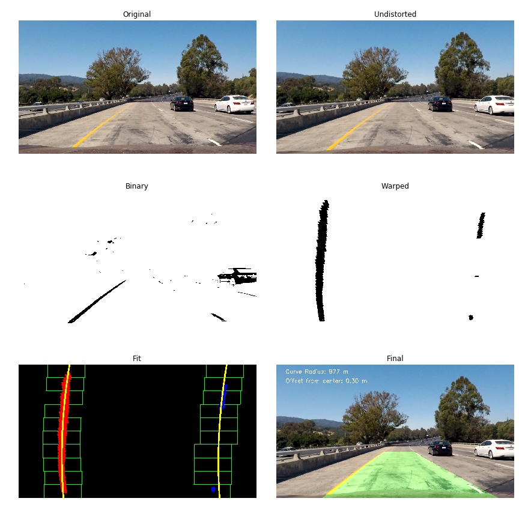
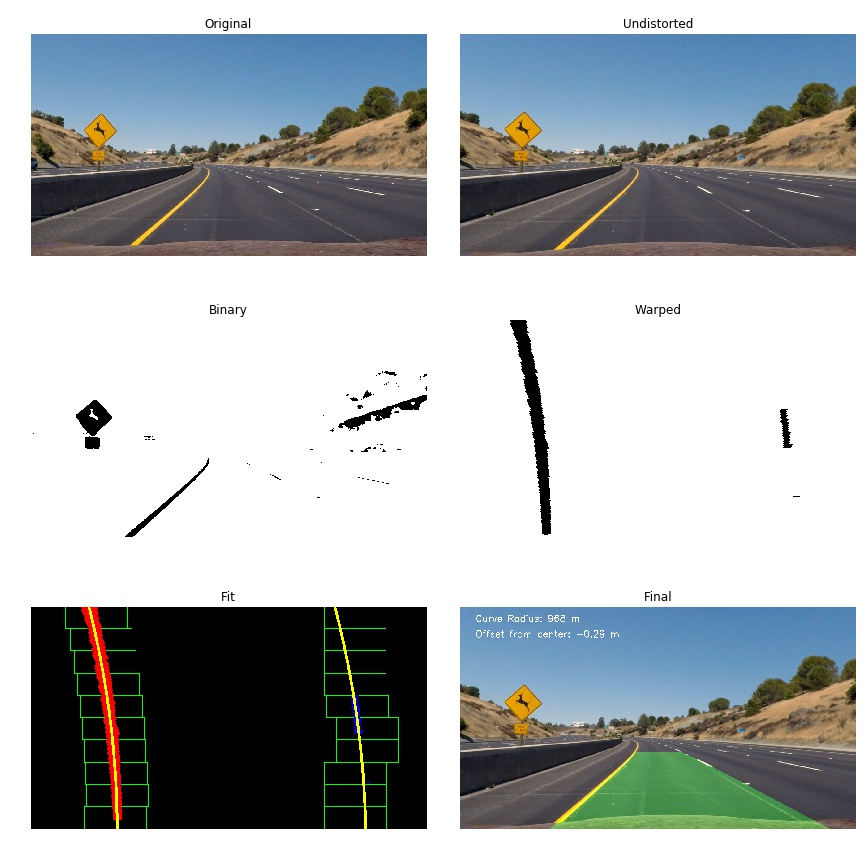
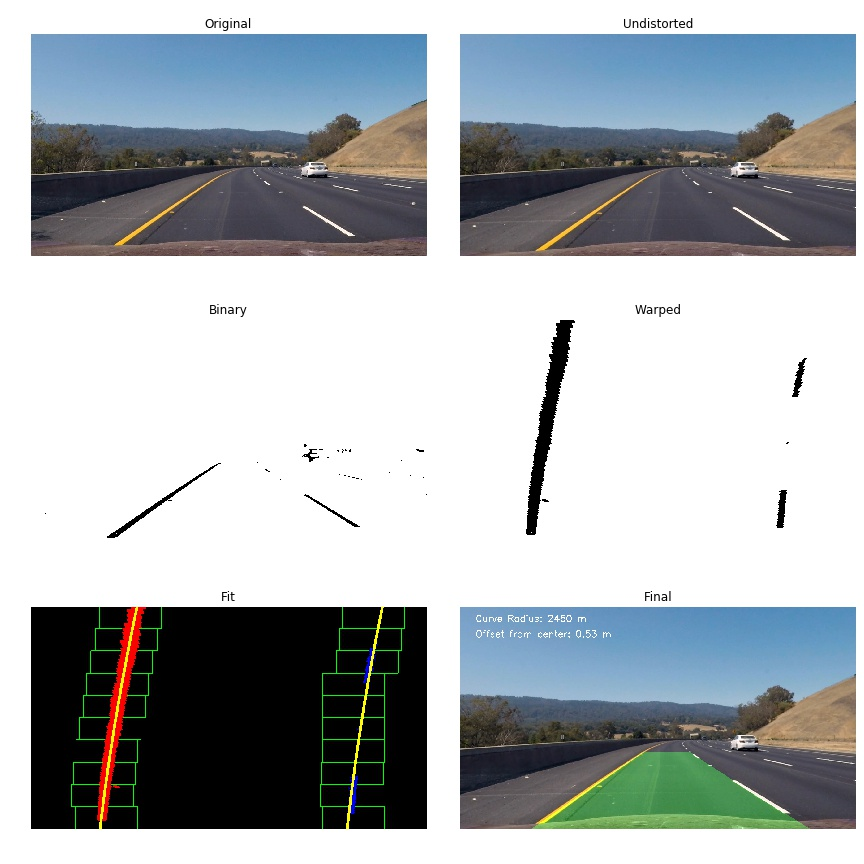
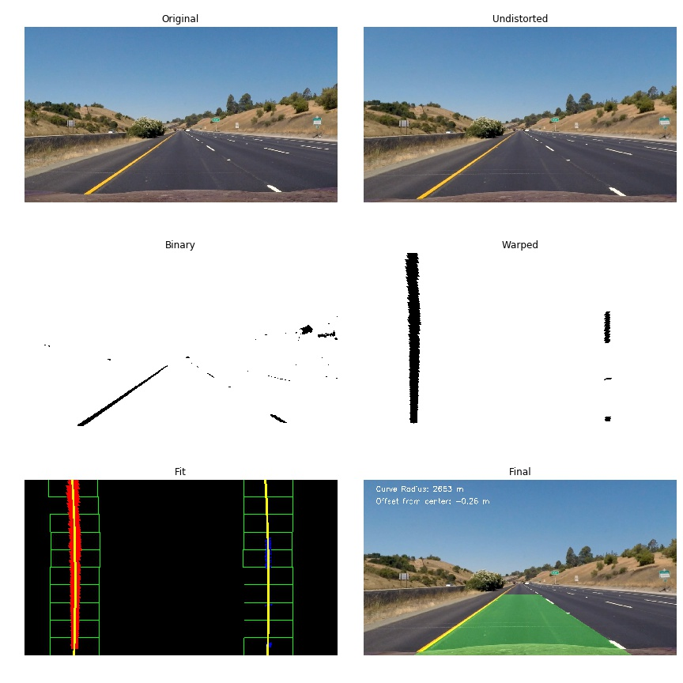
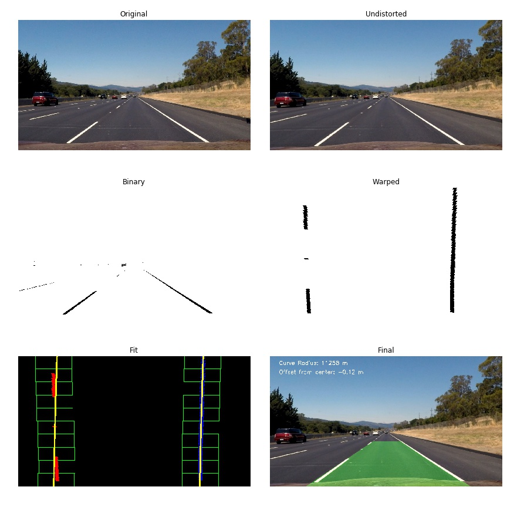

## Writeup Template

### You can use this file as a template for your writeup if you want to submit it as a markdown file, but feel free to use some other method and submit a pdf if you prefer.

---

**Advanced Lane Finding Project**

The goals / steps of this project are the following:

* Compute the camera calibration matrix and distortion coefficients given a set of chessboard images.
* Apply a distortion correction to raw images.
* Use color transforms, gradients, etc., to create a thresholded binary image.
* Apply a perspective transform to rectify binary image ("birds-eye view").
* Detect lane pixels and fit to find the lane boundary.
* Determine the curvature of the lane and vehicle position with respect to center.
* Warp the detected lane boundaries back onto the original image.
* Output visual display of the lane boundaries and numerical estimation of lane curvature and vehicle position.

### Here I will consider the rubric points individually and describe how I addressed each point in my implementation.  

---

### Writeup / README

Camera Calibration

#### 1. Briefly state how you computed the camera matrix and distortion coefficients. Provide an example of a distortion corrected calibration image.

In this project, the camera calibration is performed by using the Chessboard Corners method.  

The code for this step is contained in calibration.ipynb. 
I then used the `objpoints` and `imgpoints` to compute the camera calibration and distortion coefficients using the `cv2.calibrateCamera()` function.  
I applied this distortion correction to the test image using the `cv2.undistort()` function and obtained this result: 

![alt text][image1]

The calibration constants are written in output_images/camera_cal_mtx_dist.p

### Pipeline (single images)

I combined all images created for each step of the pipeline. The images are located in output_images. By, most of the functions can used in utils.py 



First, undistored picture is shown. 

#### 1. Describe how (and identify where in your code) you used color transforms, gradients or other methods to create a thresholded binary image.  Provide an example of a binary image result.

To correctly detect the lane lines I used the thresholds and cuts used in the nano course:

  * Color space mapping - RGB to HLS.
  * Color thresholding - (170, 255).
  * Gradients thresholding - (20, 100).

The above criteria works well for the project video and test images. Not so well for other videos. Check the plots in the second rows:







#### 3. Describe how (and identify where in your code) you performed a perspective transform and provide an example of a transformed image.

I made the following perspective transformation which is included in utils.py

```python

    leftupper_x=568
    rightupper_x=717	
    leftupperpoint  = [leftupper_x,470]
    rightupperpoint = [rightupper_x,470]
    
    leftlowerpoint  = [260,680]
    rightlowerpoint = [1043,680]

    src = np.float32([leftupperpoint, leftlowerpoint, rightupperpoint, rightlowerpoint])
    dst = np.float32([[200,0], [200,680], [1000,0], [1000,680]])

```

You can see clearly that my perspective transform was working as expected  from the above pictures. check pictures in folder output_images.


#### 4. Describe how (and identify where in your code) you identified lane-line pixels and fit their positions with a polynomial?

I decided to improve fitting using constrained fits( and simultaneous fits) to 
I did not use numpy polyfit. I used scipy curve_fit and fit with the second order polynomial. 
The parameters for two lanes are constrained to make better fits when we have noisy images. 
Unfortunately, it did not work well for the challenge video and harder challenge videos.

But, it works quite well for the test images and project video. The radiuses for both lanes
are giving the consistent results. Check the results for the third rows.


Also, the fitting code can be found in utils.py and main pipeline for images can be found in project.ipynb
But, the other part of codes are same as the ones in self driving car course.  

#### 5. Describe how (and identify where in your code) you calculated the radius of curvature of the lane and the position of the vehicle with respect to center.

the curvature is calculated in function calculate_radius in `utils.py`


    left_curverad = ((1 + (2*left_fit[0]*y_eval + left_fit[1])**2)**1.5) / np.absolute(2*left_fit[0])
    right_curverad = ((1 + (2*right_fit[0]*y_eval + right_fit[1])**2)**1.5) / np.absolute(2*right_fit[0]) 


#### 6. Provide an example image of your result plotted back down onto the road such that the lane area is identified clearly.

You can see that the fits work well from the test images. check the third rows. 


---

### Pipeline (video)

#### 1. Provide a link to your final video output.  Your pipeline should perform reasonably well on the entire project video (wobbly lines are ok but no catastrophic failures that would cause the car to drive off the road!).

The main code for processing image(process_image) for videos can be found in project.ipynb. We used class to store the last five fits. 

Here's a [link to my video result](./output_videos/project_video_output.mp4)

---

### Discussion

#### 1. Briefly discuss any problems / issues you faced in your implementation of this project.  Where will your pipeline likely fail?  What could you do to make it more robust?

Basically, I used the approaches described in the course except fitting. I improved fitting using scipy constrained fits. But, it worked well for test images and project videos.
But, fitting the noisy data(the challenge and harder_challenge videos) was not easy. Overall, the project looked easy for the project video using the standart approaches. 
I spent most of my time on other videos. I should have read other people's approaches who used other thresholding techniques before trying tune standard threshold and fitting methods. 
Some people used the second derivative operation (Laplacian) which was suited for images with changing conditions in lighting and contrast. 
Some people used the lab colorspace with the hls colorspace and got better results for the other videos.   


#### 2. Briefly discuss points mentioned in the review. 

First, I restructured my code just before submitting because the original code was written in one big notebook. During restructuring, i made mistake and did not check results
carefully. The original video was ok. I checked and did not see the bad fits in the original project video.   Now, I am resubmitting the code again(project_new.ipynb)

The suggestions you mentioned in review:

1. I added the following fits again. I thought its not necessary because i used the results from pixel fits to calculate radius. Second, i used scipy fits to constrain parameters 
for two lane fits, not numpy fits. But, I added as you suggested and recalculated the radius and offsets using the following fit results. 

# Fit new polynomials to x,y in world space
left_fit_cr = np.polyfit(ploty*ym_per_pix, leftx*xm_per_pix, 2)
right_fit_cr = np.polyfit(ploty*ym_per_pix, rightx*xm_per_pix, 2)

2. Good point. As you suggested, i used img_undist instead of original img both in test images and video. 

# Combine the result with the original image
result = cv2.addWeighted(image, 1, newwarp, 0.3, 0)

3. The bad fits you mentioned are gone. Somehow, I made mistake and they appeared in the video when i restructired the code. 

4. I tried some of thesholds(hls-L and lab) you suggested. I used combination of hsl-L and lab threshold other people used. It clears the noises.


 
